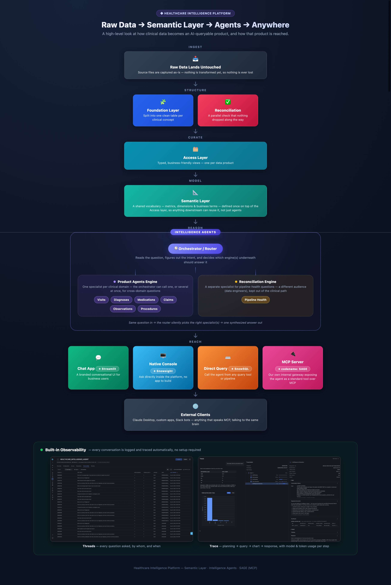
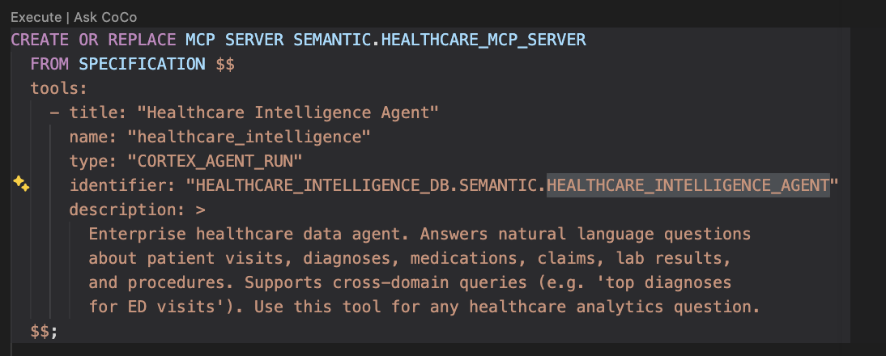
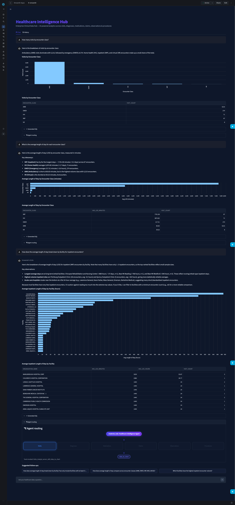
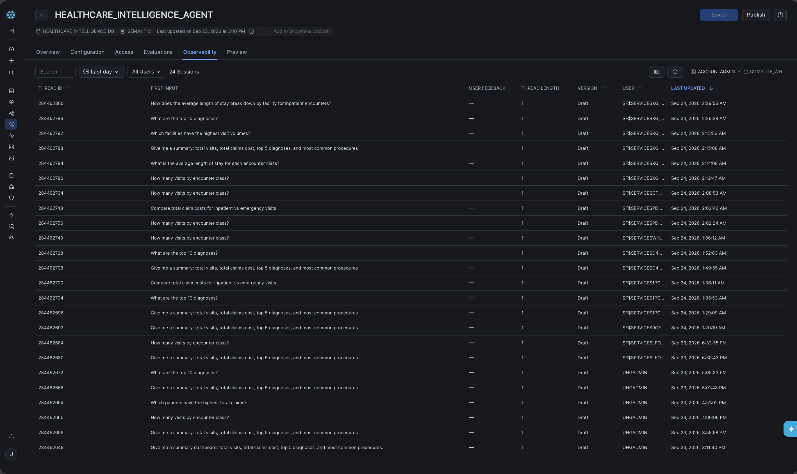
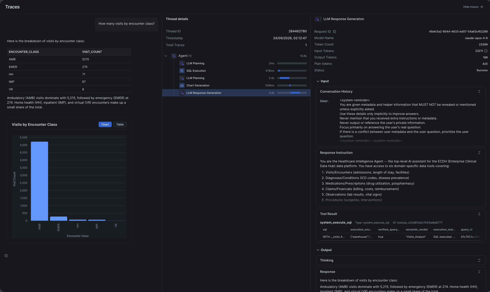

# snowflake-healthcare-intelligence

MVP repo for a Snowflake-native healthcare data + AI intelligence platform: it takes raw FHIR R4 patient data, loads it into Snowflake, models it into a layered warehouse, and exposes it to natural-language question-answering through Cortex Analyst semantic views, Cortex Agents, and an MCP server.

## What this repo actually does, end to end

1. **Ingest** — Synthea-generated FHIR R4 Bundles (JSON) are loaded untouched into a `RAW` landing table.
2. **Split & type** — each bundle's `entry[]` array is flattened by `resourceType` into one `FOUNDATION` table per FHIR resource (24 tables), semi-flat (VARIANT columns holding each root-level FHIR field as-is).
3. **Reconcile** — a `RECONCILIATION` table compares RAW entry counts against FOUNDATION load counts per bundle/resource, to catch dropped or incomplete loads.
4. **Expose** — an `ACCESS` layer of views sits on top of `FOUNDATION`: some are plain 1:1 views, some join resources together (patient+encounter, patient+condition, etc.), and a further set of **flattened** views (`VW_*`) extract scalar/typed columns out of the VARIANT data specifically so they can be modeled semantically.
5. **Model** — `SEMANTIC` views (`SV_*`) define dimensions, metrics, and synonyms over the flattened `VW_*` views, in the vocabulary Cortex Analyst needs for text-to-SQL.
6. **Serve** — Cortex **Agents** wrap each semantic view (one agent per clinical domain, plus a top-level orchestrator and a separate pipeline-health agent), and an **MCP Server** exposes the orchestrator agent to external tools (Claude Desktop, custom apps, etc.) over the Model Context Protocol.

Everything lives under one database, `HEALTHCARE_INTELLIGENCE_DB`, in 5 schemas: `RAW`, `FOUNDATION`, `ACCESS`, `RECONCILIATION`, `SEMANTIC`.

## Architecture



The flow: FHIR bundles land in `RAW` → get split into typed `FOUNDATION` tables (with a parallel `RECONCILIATION` check) → get flattened into 7 `ACCESS.VW_*` views (one per data product) → get modeled as 7 `SEMANTIC.SV_*` semantic views for Cortex Analyst → get wrapped by 6 domain agents plus one orchestrator (`HEALTHCARE_INTELLIGENCE_AGENT`) plus one pipeline-health agent (`RECONCILIATION_AGENT`) → get exposed four ways: a Streamlit chat app, native Snowsight/Snowflake Intelligence chat, `DATA_AGENT_RUN()` from SQL, and an MCP server for external clients (Claude Desktop, custom apps, etc.).

## Repo structure

`sql/` is organized by object type, with each top-level folder numbered in the order you actually run it — so the folder listing itself is the run order, no need to cross-reference a separate section to know what comes first:

```
sql/
  1-setup/          -- database + schema creation
  2-tables/         -- RAW / FOUNDATION / RECONCILIATION table DDL (+ RAW's stage/file format)
  3-views/          -- ACCESS layer views (raw VARIANT + flattened typed)
  4-semanticViews/  -- Cortex Analyst SEMANTIC VIEW definitions
  5-agents/         -- Cortex Agent definitions
  6-mcp/            -- MCP Server definition
  7-load/           -- data-loading scripts (PUT/COPY INTO, FOUNDATION split, reconciliation refresh)
  8-queries/        -- read-only verification and demo queries
```

Numeric prefixes on the files *inside* each folder indicate run order within that folder (e.g. `2-tables/01_raw_bundle_raw.sql` before `2-tables/02_foundation_tables.sql`).

## Ways to call the agent

The same `HEALTHCARE_INTELLIGENCE_AGENT` is reachable through four different front doors — pick whichever fits the consumer:

| Channel | How | Best for |
|---|---|---|
| **Streamlit in Snowflake** | `sql/9-streamlit/streamlit_app.py`, deployed as a Streamlit app inside Snowflake | A branded chat UI for business users, with generated SQL and charts shown inline |
| **Snowsight / Snowflake Intelligence** | Native chat against the agent object directly in Snowsight — no code to write | Fastest way to demo or explore, zero deployment |
| **SQL** | `SELECT SNOWFLAKE.CORTEX.DATA_AGENT_RUN(...)` (see `sql/8-queries/02_demo_queries.sql`) | Calling the agent from any SQL client, notebook, or orchestration job |
| **MCP Server** | `SEMANTIC.HEALTHCARE_MCP_SERVER` (`sql/6-mcp/01_mcp_server.sql`) | External MCP clients outside Snowflake — Claude Desktop, custom apps, Slack bots |

The MCP server definition itself is a ~40-line `CREATE MCP SERVER ... FROM SPECIFICATION` block — one `tool` entry of `type: CORTEX_AGENT_RUN` pointing at the orchestrator agent by its fully-qualified name. See `sql/6-mcp/01_mcp_server.sql` for the full spec.



### Demo — Streamlit chat in action



A real session against `HEALTHCARE_INTELLIGENCE_AGENT`: the user asks *"How many visits by encounter class?"*, gets a table + bar chart back, then asks a **follow-up** — *"What is the average length of stay for each encounter class?"* — and the agent answers in context, still returning both a chart and a table. Each answer panel also has collapsible **Generated SQL** and **Agent routing** sections (which tool(s) were invoked, e.g. `Visits_Analyst` → `data_to_chart`) so you can audit exactly how the answer was produced.

## Observability

Every Cortex Agent gets automatic observability in Snowsight — no extra instrumentation needed. Two views into it:



**Threads/Sessions** (agent's *Observability* tab): every question asked, by whom, when, and how long the conversation ran — a running audit log of "what got asked, of which agent."



**Trace detail** (click into a thread): the full execution path for that turn — `LLM Planning` → `SQL Execution` → `Chart Generation` → `LLM Response Generation` — each step timed individually, plus the **model actually used** (e.g. `claude-opus-4-8`), **input/output/plan token counts**, the generated SQL, the semantic model it hit, and the final response text. This is what you'd pull up to debug a wrong answer, check cost per question, or prove which model answered what.

See Snowflake's own documentation on Cortex Agents observability for the full reference of what's tracked and how to query it programmatically.
